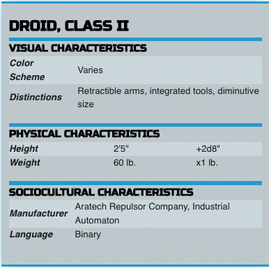
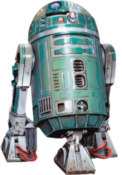
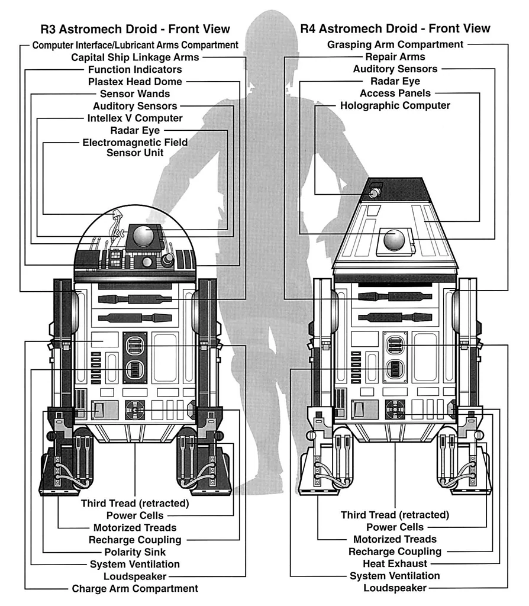

### Appearance

Class II droids are typically small, standing between two and four feet. Their form and color scheme vary based on tasks for which they are created, their affiliation, or quirks of their owner.

They are noteworthy for their distinct, function-oriented form.

### Utility

Class II droids are programmed for engineering and other technical sciences. They differ from class one droids because they apply the science to real-life situations. Class II droids are rarely equipped with Basic vocabulators, instead communicating through Binary. There are five subcategories of class II droids. Astromech, exploration, environmental, engineering, and maintenance droids are all class II droids.

### Names

Droids are typically called by their designation, given to them when they are created, or some affectation given to them by their owner. Often this affectation is a play on their designation. Occasionally, noteworthy droids will earn monikers based on their accomplishments.

**Designations (Names).** BB-5 (Beebees), CH-33P (Cheep), OC-JK14 (Seejay), PT-7 (Poot), RG-G1 (G-G)

### Droid, Class II Traits

As a Droid, Class II, you have the following special traits.

**_Ability Score Increase._** Your Intelligence score increases by 2, and your Dexterity or Wisdom score increases by 1.

**_Age._** Droids don’t age, though they require maintenance to retain functionality.

**_Alignment._** Droids tend toward no particular alignment. The best and worst are found among them.

**_Size._** Class II droids stand 2 to 4 feet tall and weigh about 70 lbs. Regardless of your position in that range, your size is Small.

**_Speed._** Your base walking speed is 25 feet.

**_Type._** Your creature type is droid.

**_Armor Integration._** You can not wear armor, but you can have the armor professionally integrated into your chassis over the course of a long rest. This work must be done by someone proficient with astrotech’s implements. You must be proficient in armor in order to have it integrated.

**_Droid Resistances._** You are resistant to necrotic, poison, and psychic damage, and are immune to poison and disease.

**_Droid Systems._** You do not need to eat or drink. Additionally, you no longer require a tech focus to cast tech powers.

**_Droid Vulnerabilities._** You are vulnerable to ion damage. Additionally, you have disadvantage on saving throws against effects that would deal ion or lightning damage.

**_Force-Insensitive._** While droids can be manipulated by many force powers, they can not sense the Force. You can not use force powers or take levels in forcecasting classes.

**_Integrated Engineering._** You have proficiency in one specialist’s kit of your choice. The chosen kit is integrated into your chassis, and can not be removed while you are conscious. ^3afb20

**_Maintenance Mode._** Rather than sleep, you must spend 3 hours performing routine maintenance during a long rest to gain its benefits, during which you have disadvantage on Wisdom (Perception) checks. Additionally, if your long rest would be interrupted, you only need to complete the long rest instead of restarting it.

**_Rapid Reconstruction._** You are built with internal repair mechanisms. As a bonus action, you can choose to spend one of your Hit Dice to recover hit points.

**_Skill Protocol._** You have proficiency in two skills of your choice. ^389fb5

**_Undersized._** Your small stature makes it hard for you to wield bigger weapons. You can’t use heavy shields. Additionally, you can’t use martial weapons with the two-handed property unless it also has the light property, and if a martial weapon has the versatile property, you can only wield it in two hands.

**_Languages._** You can speak, read, and write Binary. You can understand spoken and written Galactic Basic and one language of your choice, but you can not speak them.
